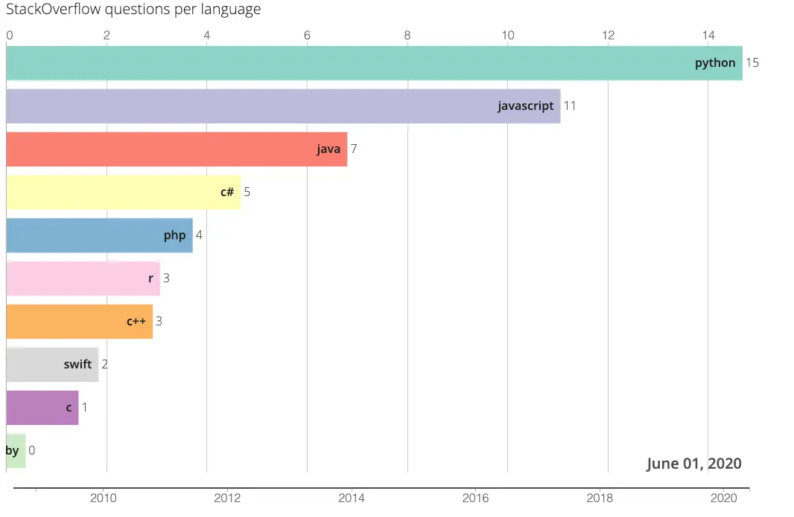

# barchartrace

Local bar chart race generator, forked from [barchartrace][barchartrace], rewritten in Vue 3 + D3 v7 + PapaParse 5.

## Usage

> [!NOTE]
> While the CSV files never leaves your browser,
> this program does need to fetch resources from jsDelivr CDN,
> so it would not work in a completely offline environment.

Just open [index.html](index.html), load CSV, (optionally configure) and generate.

## CSV Format

Date should be in ISO format, i.e. `YYYY-MM-DD`.

Option 1 : one row per date (ordered) and one column per contender.

Date | Name1 | Name2
--- | --- | ---
2018-01-01 | 1 | 1
2018-02-01 | 2 | 3
2018-03-01 | 4 | 7

Option 2 : one row per contender and per date (row order doesn't matter)

Date | Name | Value
--- | --- | ---
2018-01-01 | Name1 | 1
2018-01-01 | Name2 | 3
2018-02-01 | Name1 | 2
2018-02-01 | Name2 | 3
2018-03-01 | Name1 | 4
2018-03-01 | Name2 | 7

## Screenshot

[barchartrace]: https://github.com/FabDevGit/barchartrace
